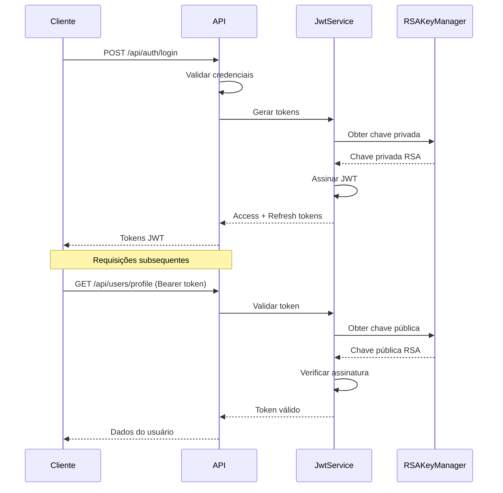

# Documentação de Segurança - Sistema Java Backend

## 🔐 Visão Geral

Este documento detalha todas as implementações de segurança do Sistema Java Backend, incluindo autenticação JWT, gerenciamento de chaves RSA, configurações de segurança, proteções contra ataques e melhores práticas implementadas.

## 📋 Índice

1. [Autenticação JWT](#autenticação-jwt)
2. [Gerenciamento de Chaves RSA](#gerenciamento-de-chaves-rsa)
3. [Configurações de Segurança](#configurações-de-segurança)
4. [Rate Limiting](#rate-limiting)
5. [Proteção contra Ataques](#proteção-contra-ataques)
6. [Validações de Segurança](#validações-de-segurança)
7. [Logs de Segurança](#logs-de-segurança)
8. [Configuração de Ambiente](#configuração-de-ambiente)
9. [Melhores Práticas](#melhores-práticas)
10. [Troubleshooting](#troubleshooting)

---

## 🔑 Autenticação JWT

### Implementação

O sistema utiliza **JSON Web Tokens (JWT)** com assinatura **RSA256** para autenticação stateless e segura.

#### Estrutura do Token

```json
{
  "header": {
    "alg": "RS256",
    "typ": "JWT"
  },
  "payload": {
    "sub": "user@example.com",
    "userId": 123,
    "role": "USER",
    "iat": 1642248000,
    "exp": 1642334400,
    "iss": "sistema-java-backend",
    "aud": "sistema-java-frontend"
  }
}
```

#### Configurações JWT

| Parâmetro | Valor Padrão | Descrição |
|-----------|--------------|-----------|
| **Algoritmo** | RS256 | Assinatura RSA com SHA-256 |
| **Validade Access Token** | 24 horas | Tempo de vida do token de acesso |
| **Validade Refresh Token** | 7 dias | Tempo de vida do token de renovação |
| **Issuer** | sistema-java-backend | Identificador do emissor |
| **Audience** | sistema-java-frontend | Público-alvo do token |

#### Fluxo de Autenticação



#### Implementação do JwtService

```java
@Service
public class JwtService {
    
    private final RSAKeyManager keyManager;
    
    // Gerar Access Token
    public String generateAccessToken(UserDetails userDetails) {
        return Jwts.builder()
            .setSubject(userDetails.getUsername())
            .claim("userId", getUserId(userDetails))
            .claim("role", getRole(userDetails))
            .setIssuedAt(new Date())
            .setExpiration(new Date(System.currentTimeMillis() + ACCESS_TOKEN_VALIDITY))
            .setIssuer("sistema-java-backend")
            .setAudience("sistema-java-frontend")
            .signWith(keyManager.getPrivateKey(), SignatureAlgorithm.RS256)
            .compact();
    }
    
    // Validar Token
    public boolean validateToken(String token) {
        try {
            Jwts.parserBuilder()
                .setSigningKey(keyManager.getPublicKey())
                .requireIssuer("sistema-java-backend")
                .requireAudience("sistema-java-frontend")
                .build()
                .parseClaimsJws(token);
            return true;
        } catch (JwtException | IllegalArgumentException e) {
            return false;
        }
    }
}
```

---

## 🔐 Gerenciamento de Chaves RSA

### RSAKeyManager

O sistema utiliza chaves RSA de **2048 bits** para assinatura e verificação de tokens JWT.

#### Configuração

```yaml
app:
  rsa:
    keys:
      directory: "./keys"  # Diretório das chaves (configurável)
      private-key-file: "private_key.pem"
      public-key-file: "public_key.pem"
      key-size: 2048
      auto-generate: true  # Gerar automaticamente se não existir
```

#### Estrutura de Arquivos

```
projeto/
├── keys/                    # Diretório de chaves (padrão)
│   ├── private_key.pem     # Chave privada RSA
│   └── public_key.pem      # Chave pública RSA
└── src/
    └── main/
        └── java/
            └── com/sistema/
                └── security/
                    └── RSAKeyManager.java
```

#### Implementação do RSAKeyManager

```java
@Component
public class RSAKeyManager {
    
    private static final String DEFAULT_KEYS_DIRECTORY = "./keys";
    private static final String PRIVATE_KEY_FILE = "private_key.pem";
    private static final String PUBLIC_KEY_FILE = "public_key.pem";
    private static final int KEY_SIZE = 2048;
    
    private RSAPrivateKey privateKey;
    private RSAPublicKey publicKey;
    
    @PostConstruct
    public void initializeKeys() {
        String keysDirectory = getKeysDirectory();
        
        if (!keysExist(keysDirectory)) {
            generateKeyPair(keysDirectory);
        }
        
        loadKeys(keysDirectory);
    }
    
    private void generateKeyPair(String directory) {
        try {
            KeyPairGenerator keyGen = KeyPairGenerator.getInstance("RSA");
            keyGen.initialize(KEY_SIZE);
            KeyPair keyPair = keyGen.generateKeyPair();
            
            savePrivateKey(keyPair.getPrivate(), directory);
            savePublicKey(keyPair.getPublic(), directory);
            
        } catch (Exception e) {
            throw new RuntimeException("Erro ao gerar chaves RSA", e);
        }
    }
}
```

#### Rotação de Chaves

**Processo Manual**:
1. Backup das chaves atuais
2. Geração de novo par de chaves
3. Atualização gradual dos tokens
4. Remoção das chaves antigas

**Comando para Rotação**:
```bash
# Backup das chaves atuais
cp keys/private_key.pem keys/private_key.pem.backup
cp keys/public_key.pem keys/public_key.pem.backup

# Remover chaves atuais (serão regeneradas automaticamente)
rm keys/private_key.pem keys/public_key.pem

# Reiniciar aplicação para gerar novas chaves
./mvnw spring-boot:run
```

---

## 🛡️ Configurações de Segurança

### SecurityConfig

```java
@Configuration
@EnableWebSecurity
@EnableMethodSecurity(prePostEnabled = true)
public class SecurityConfig {
    
    @Bean
    public SecurityFilterChain filterChain(HttpSecurity http) throws Exception {
        return http
            .csrf(csrf -> csrf.disable())
            .sessionManagement(session -> 
                session.sessionCreationPolicy(SessionCreationPolicy.STATELESS))
            .authorizeHttpRequests(auth -> auth
                // Endpoints públicos
                .requestMatchers("/api/auth/**").permitAll()
                .requestMatchers("/api/health").permitAll()
                .requestMatchers("/api/info").permitAll()
                .requestMatchers("/api/captcha/**").permitAll()
                
                // Endpoints protegidos
                .requestMatchers("/api/users/**").authenticated()
                .requestMatchers("/api/admin/**").hasRole("ADMIN")
                
                // Qualquer outra requisição
                .anyRequest().authenticated()
            )
            .addFilterBefore(jwtAuthenticationFilter, UsernamePasswordAuthenticationFilter.class)
            .exceptionHandling(ex -> ex
                .authenticationEntryPoint(jwtAuthenticationEntryPoint)
                .accessDeniedHandler(jwtAccessDeniedHandler)
            )
            .build();
    }
}
```

### Headers de Segurança

```java
@Bean
public SecurityFilterChain securityHeaders(HttpSecurity http) throws Exception {
    return http
        .headers(headers -> headers
            .frameOptions().deny()
            .contentTypeOptions().and()
            .httpStrictTransportSecurity(hstsConfig -> hstsConfig
                .maxAgeInSeconds(31536000)
                .includeSubdomains(true)
                .preload(true)
            )
            .and()
            .addHeaderWriter(new StaticHeadersWriter(
                "X-Content-Type-Options", "nosniff",
                "X-Frame-Options", "DENY",
                "X-XSS-Protection", "1; mode=block",
                "Referrer-Policy", "strict-origin-when-cross-origin",
                "Permissions-Policy", "geolocation=(), microphone=(), camera=()"
            ))
        )
        .build();
}
```

---

## ⏱️ Rate Limiting

### Implementação

O sistema implementa rate limiting em múltiplas camadas para prevenir abuso e ataques de força bruta.

#### Configurações por Endpoint

| Endpoint | Limite | Janela | Bloqueio |
|----------|--------|--------|----------|
| `/api/auth/login` | 5 tentativas | 15 min | 30 min |
| `/api/auth/register` | 3 tentativas | 1 hora | 1 hora |
| `/api/auth/resend-verification` | 3 tentativas | 1 hora | 1 hora |
| `/api/captcha` | 10 tentativas | 1 min | 1 min |
| Endpoints gerais | 100 req | 1 min | 1 min |

#### Implementação com Redis

```java
@Component
public class RateLimitService {
    
    private final RedisTemplate<String, String> redisTemplate;
    
    public boolean isAllowed(String key, int maxAttempts, Duration window) {
        String redisKey = "rate_limit:" + key;
        
        String currentValue = redisTemplate.opsForValue().get(redisKey);
        
        if (currentValue == null) {
            redisTemplate.opsForValue().set(redisKey, "1", window);
            return true;
        }
        
        int attempts = Integer.parseInt(currentValue);
        
        if (attempts >= maxAttempts) {
            return false;
        }
        
        redisTemplate.opsForValue().increment(redisKey);
        return true;
    }
}
```

#### Rate Limiting por IP

```java
@Component
public class IpRateLimitFilter implements Filter {
    
    @Override
    public void doFilter(ServletRequest request, ServletResponse response, 
                        FilterChain chain) throws IOException, ServletException {
        
        HttpServletRequest httpRequest = (HttpServletRequest) request;
        String clientIp = getClientIpAddress(httpRequest);
        String endpoint = httpRequest.getRequestURI();
        
        RateLimitConfig config = getRateLimitConfig(endpoint);
        
        if (!rateLimitService.isAllowed(clientIp + ":" + endpoint, 
                                       config.getMaxAttempts(), 
                                       config.getWindow())) {
            
            HttpServletResponse httpResponse = (HttpServletResponse) response;
            httpResponse.setStatus(HttpStatus.TOO_MANY_REQUESTS.value());
            httpResponse.setContentType("application/json");
            
            ErrorResponse error = new ErrorResponse(
                "Rate limit excedido",
                "RATE_LIMIT_EXCEEDED",
                429,
                httpRequest.getRequestURI()
            );
            
            httpResponse.getWriter().write(objectMapper.writeValueAsString(error));
            return;
        }
        
        chain.doFilter(request, response);
    }
}
```

---

## 🛡️ Proteção contra Ataques

### 1. Proteção CSRF

```java
// CSRF desabilitado para API REST stateless
.csrf(csrf -> csrf.disable())

// Para aplicações com sessões, usar:
.csrf(csrf -> csrf
    .csrfTokenRepository(CookieCsrfTokenRepository.withHttpOnlyFalse())
    .ignoringRequestMatchers("/api/auth/**")
)
```

### 2. Proteção XSS

```java
// Sanitização de entrada
@Component
public class XssProtectionService {
    
    private final PolicyFactory policy = Sanitizers.FORMATTING
        .and(Sanitizers.LINKS)
        .and(Sanitizers.BLOCKS);
    
    public String sanitize(String input) {
        if (input == null) return null;
        return policy.sanitize(input);
    }
}

// Uso em DTOs
public class UserRegistrationDto {
    
    @NotBlank
    @Size(min = 2, max = 100)
    private String nome;
    
    public void setNome(String nome) {
        this.nome = xssProtectionService.sanitize(nome);
    }
}
```

### 3. Proteção SQL Injection

```java
// Uso de JPA/Hibernate com parâmetros seguros
@Repository
public class UserRepository {
    
    @Query("SELECT u FROM User u WHERE u.email = :email AND u.status = :status")
    Optional<User> findByEmailAndStatus(@Param("email") String email, 
                                       @Param("status") UserStatus status);
    
    // NUNCA fazer concatenação de strings em queries
    // ERRADO: "SELECT * FROM users WHERE email = '" + email + "'"
}
```

### 4. Proteção contra Timing Attacks

```java
@Service
public class AuthenticationService {
    
    public boolean authenticate(String email, String password) {
        Optional<User> userOpt = userRepository.findByEmail(email);
        
        // Sempre executar hash mesmo se usuário não existir
        String dummyHash = "$2a$10$dummyHashToPreventTimingAttacks";
        String targetHash = userOpt.map(User::getPasswordHash).orElse(dummyHash);
        
        boolean passwordMatches = passwordEncoder.matches(password, targetHash);
        
        return userOpt.isPresent() && passwordMatches;
    }
}
```

### 5. Proteção contra Session Fixation

```java
// Configuração stateless previne session fixation
.sessionManagement(session -> 
    session.sessionCreationPolicy(SessionCreationPolicy.STATELESS))

// Para aplicações com sessões:
.sessionManagement(session -> session
    .sessionFixation().migrateSession()
    .maximumSessions(1)
    .maxSessionsPreventsLogin(false)
)
```

---

## ✅ Validações de Segurança

### 1. Validação de Senha

```java
@Component
public class PasswordValidator {
    
    private static final String PASSWORD_PATTERN = 
        "^(?=.*[a-z])(?=.*[A-Z])(?=.*\\d)(?=.*[@$!%*?&])[A-Za-z\\d@$!%*?&]{8,}$";
    
    private static final Pattern pattern = Pattern.compile(PASSWORD_PATTERN);
    
    public boolean isValid(String password) {
        if (password == null || password.length() < 8) {
            return false;
        }
        
        return pattern.matcher(password).matches() && 
               !isCommonPassword(password) &&
               !containsPersonalInfo(password);
    }
    
    private boolean isCommonPassword(String password) {
        Set<String> commonPasswords = Set.of(
            "password", "123456789", "qwerty", "abc123", 
            "password123", "admin", "letmein"
        );
        return commonPasswords.contains(password.toLowerCase());
    }
}
```

### 2. Validação de CPF

```java
@Component
public class CpfValidator {
    
    public boolean isValid(String cpf) {
        if (cpf == null) return false;
        
        // Remove formatação
        cpf = cpf.replaceAll("[^0-9]", "");
        
        // Verifica tamanho
        if (cpf.length() != 11) return false;
        
        // Verifica sequências inválidas
        if (cpf.matches("(\\d)\\1{10}")) return false;
        
        // Valida dígitos verificadores
        return validateCheckDigits(cpf);
    }
    
    private boolean validateCheckDigits(String cpf) {
        // Implementação completa da validação de CPF
        // ...
    }
}
```

### 3. Validação de Email

```java
@Component
public class EmailValidator {
    
    private static final String EMAIL_PATTERN = 
        "^[a-zA-Z0-9._%+-]+@[a-zA-Z0-9.-]+\\.[a-zA-Z]{2,}$";
    
    private static final Pattern pattern = Pattern.compile(EMAIL_PATTERN);
    
    public boolean isValid(String email) {
        if (email == null || email.trim().isEmpty()) {
            return false;
        }
        
        email = email.trim().toLowerCase();
        
        return pattern.matcher(email).matches() && 
               !isDisposableEmail(email) &&
               email.length() <= 254; // RFC 5321 limit
    }
    
    private boolean isDisposableEmail(String email) {
        Set<String> disposableDomains = Set.of(
            "10minutemail.com", "tempmail.org", "guerrillamail.com"
        );
        
        String domain = email.substring(email.indexOf('@') + 1);
        return disposableDomains.contains(domain);
    }
}
```

---

## 📊 Logs de Segurança

### Configuração de Logging

```yaml
logging:
  level:
    com.sistema.security: DEBUG
    org.springframework.security: INFO
    org.springframework.web.filter.CommonsRequestLoggingFilter: DEBUG
  pattern:
    console: "%d{yyyy-MM-dd HH:mm:ss} [%thread] %-5level [%X{traceId}] %logger{36} - %msg%n"
    file: "%d{yyyy-MM-dd HH:mm:ss} [%thread] %-5level [%X{traceId}] %logger{36} - %msg%n"
  file:
    name: logs/security.log
    max-size: 10MB
    max-history: 30
```

### Eventos de Segurança Logados

```java
@Component
public class SecurityEventLogger {
    
    private static final Logger securityLogger = 
        LoggerFactory.getLogger("SECURITY");
    
    public void logSuccessfulLogin(String email, String ip) {
        securityLogger.info("LOGIN_SUCCESS: user={}, ip={}", email, ip);
    }
    
    public void logFailedLogin(String email, String ip, String reason) {
        securityLogger.warn("LOGIN_FAILED: user={}, ip={}, reason={}", 
                           email, ip, reason);
    }
    
    public void logAccountLocked(String email, String ip) {
        securityLogger.error("ACCOUNT_LOCKED: user={}, ip={}", email, ip);
    }
    
    public void logRateLimitExceeded(String ip, String endpoint) {
        securityLogger.warn("RATE_LIMIT_EXCEEDED: ip={}, endpoint={}", 
                           ip, endpoint);
    }
    
    public void logSuspiciousActivity(String email, String ip, String activity) {
        securityLogger.error("SUSPICIOUS_ACTIVITY: user={}, ip={}, activity={}", 
                            email, ip, activity);
    }
}
```

### Monitoramento de Segurança

```java
@Component
public class SecurityMonitor {
    
    @EventListener
    public void handleAuthenticationSuccess(AuthenticationSuccessEvent event) {
        String username = event.getAuthentication().getName();
        String ip = getClientIpAddress();
        
        securityEventLogger.logSuccessfulLogin(username, ip);
        
        // Verificar login de localização suspeita
        if (isUnusualLocation(username, ip)) {
            securityEventLogger.logSuspiciousActivity(
                username, ip, "LOGIN_FROM_UNUSUAL_LOCATION");
            // Enviar notificação por email
            emailService.sendSecurityAlert(username, ip);
        }
    }
    
    @EventListener
    public void handleAuthenticationFailure(AbstractAuthenticationFailureEvent event) {
        String username = event.getAuthentication().getName();
        String ip = getClientIpAddress();
        String reason = event.getException().getMessage();
        
        securityEventLogger.logFailedLogin(username, ip, reason);
        
        // Incrementar contador de tentativas falhadas
        failedLoginAttemptService.recordFailedAttempt(username, ip);
    }
}
```

---

## 🔧 Configuração de Ambiente

### Variáveis de Ambiente

```bash
# Configurações JWT
JWT_ACCESS_TOKEN_VALIDITY=86400000    # 24 horas em ms
JWT_REFRESH_TOKEN_VALIDITY=604800000  # 7 dias em ms
JWT_ISSUER=sistema-java-backend
JWT_AUDIENCE=sistema-java-frontend

# Configurações RSA
RSA_KEYS_DIRECTORY=./keys
RSA_KEY_SIZE=2048
RSA_AUTO_GENERATE=true

# Configurações de Rate Limiting
RATE_LIMIT_LOGIN_MAX_ATTEMPTS=5
RATE_LIMIT_LOGIN_WINDOW_MINUTES=15
RATE_LIMIT_LOGIN_BLOCK_MINUTES=30

# Configurações de Segurança
SECURITY_REQUIRE_HTTPS=true
SECURITY_HSTS_MAX_AGE=31536000
SECURITY_CONTENT_TYPE_OPTIONS=true

# Configurações de Banco
DB_ENCRYPT_PASSWORD=true
DB_SSL_MODE=require

# Configurações de Email
EMAIL_TLS_ENABLED=true
EMAIL_SSL_ENABLED=false
EMAIL_AUTH_ENABLED=true
```

### Configuração para Produção

```yaml
# application-prod.yml
spring:
  datasource:
    url: jdbc:postgresql://localhost:5432/sistema_prod?sslmode=require
    username: ${DB_USERNAME}
    password: ${DB_PASSWORD}
    hikari:
      maximum-pool-size: 20
      minimum-idle: 5
      connection-timeout: 30000
      idle-timeout: 600000
      max-lifetime: 1800000

  redis:
    host: ${REDIS_HOST}
    port: ${REDIS_PORT}
    password: ${REDIS_PASSWORD}
    ssl: true
    timeout: 2000ms

server:
  ssl:
    enabled: true
    key-store: ${SSL_KEYSTORE_PATH}
    key-store-password: ${SSL_KEYSTORE_PASSWORD}
    key-store-type: PKCS12
  port: 8443

app:
  security:
    require-https: true
    hsts-max-age: 31536000
    content-security-policy: "default-src 'self'; script-src 'self' 'unsafe-inline'"
```

---

## 📋 Melhores Práticas

### 1. Gerenciamento de Senhas

- ✅ **Hash com BCrypt**: Usar BCrypt com cost factor 12+
- ✅ **Salt único**: BCrypt gera salt automaticamente
- ✅ **Validação forte**: Mínimo 8 caracteres, maiúscula, minúscula, número, especial
- ✅ **Histórico de senhas**: Prevenir reutilização das últimas 5 senhas
- ✅ **Expiração**: Forçar troca a cada 90 dias (opcional)

### 2. Tokens JWT

- ✅ **Tempo de vida curto**: Access token com 24h máximo
- ✅ **Refresh token**: Para renovação sem re-login
- ✅ **Revogação**: Lista negra de tokens comprometidos
- ✅ **Claims mínimos**: Apenas informações essenciais
- ✅ **Assinatura forte**: RSA256 com chaves 2048+ bits

### 3. Comunicação

- ✅ **HTTPS obrigatório**: Todas as comunicações criptografadas
- ✅ **HSTS**: Forçar HTTPS no navegador
- ✅ **Certificate Pinning**: Para aplicações móveis
- ✅ **Headers de segurança**: CSP, X-Frame-Options, etc.

### 4. Dados Sensíveis

- ✅ **Criptografia em repouso**: Dados sensíveis no banco
- ✅ **Mascaramento**: Logs não devem conter dados sensíveis
- ✅ **Retenção limitada**: Purgar dados antigos
- ✅ **Backup seguro**: Backups criptografados

### 5. Monitoramento

- ✅ **Logs de segurança**: Todos os eventos importantes
- ✅ **Alertas automáticos**: Para atividades suspeitas
- ✅ **Métricas**: Rate limiting, tentativas de login, etc.
- ✅ **Auditoria**: Trilha completa de ações sensíveis

---

## 🔍 Troubleshooting

### Problemas Comuns

#### 1. Token JWT Inválido

**Sintomas**:
- Status 401 em requisições autenticadas
- Mensagem "Token inválido ou expirado"

**Possíveis Causas**:
- Token expirado
- Chaves RSA alteradas
- Formato de token incorreto
- Claims obrigatórios ausentes

**Soluções**:
```bash
# Verificar validade do token
curl -X POST http://localhost:8080/api/auth/refresh-token \
  -H "Content-Type: application/json" \
  -d '{"refreshToken": "seu_refresh_token"}'

# Verificar logs de segurança
tail -f logs/security.log | grep JWT

# Regenerar chaves RSA (último recurso)
rm keys/*.pem && ./mvnw spring-boot:run
```

#### 2. Rate Limit Atingido

**Sintomas**:
- Status 429 Too Many Requests
- Bloqueio temporário de IP

**Soluções**:
```bash
# Verificar status no Redis
redis-cli GET "rate_limit:192.168.1.100:/api/auth/login"

# Limpar rate limit manualmente (desenvolvimento)
redis-cli DEL "rate_limit:192.168.1.100:/api/auth/login"

# Verificar configurações
grep -r "rate.limit" src/main/resources/
```

#### 3. Chaves RSA Não Encontradas

**Sintomas**:
- Erro na inicialização da aplicação
- "Arquivo de chave não encontrado"

**Soluções**:
```bash
# Verificar diretório de chaves
ls -la keys/

# Verificar permissões
chmod 600 keys/private_key.pem
chmod 644 keys/public_key.pem

# Regenerar chaves
rm -rf keys/ && mkdir keys && ./mvnw spring-boot:run
```

#### 4. Problemas de CORS

**Sintomas**:
- Erro CORS no navegador
- Requisições bloqueadas

**Soluções**:
```java
// Configurar CORS adequadamente
@CrossOrigin(origins = {"http://localhost:3000", "https://app.exemplo.com"})
@RestController
public class AuthController {
    // ...
}

// Ou configuração global
@Configuration
public class CorsConfig {
    @Bean
    public CorsConfigurationSource corsConfigurationSource() {
        CorsConfiguration configuration = new CorsConfiguration();
        configuration.setAllowedOriginPatterns(Arrays.asList("*"));
        configuration.setAllowedMethods(Arrays.asList("*"));
        configuration.setAllowedHeaders(Arrays.asList("*"));
        configuration.setAllowCredentials(true);
        
        UrlBasedCorsConfigurationSource source = new UrlBasedCorsConfigurationSource();
        source.registerCorsConfiguration("/**", configuration);
        return source;
    }
}
```

### Comandos Úteis

```bash
# Verificar status da aplicação
curl http://localhost:8080/api/health

# Testar autenticação
curl -X POST http://localhost:8080/api/auth/login \
  -H "Content-Type: application/json" \
  -d '{"email":"test@example.com","senha":"password"}'

# Verificar token JWT
echo "eyJhbGciOiJSUzI1NiJ9..." | base64 -d

# Monitorar logs em tempo real
tail -f logs/security.log

# Verificar conexões ativas
netstat -an | grep :8080

# Verificar uso de memória
jps -v | grep spring-boot
```

---

## 📚 Referências

- [OWASP Top 10](https://owasp.org/www-project-top-ten/)
- [JWT Best Practices](https://tools.ietf.org/html/rfc8725)
- [Spring Security Reference](https://docs.spring.io/spring-security/reference/)
- [NIST Cybersecurity Framework](https://www.nist.gov/cyberframework)

---

**Documentação atualizada em: Janeiro 2024**  
**Versão: 1.0.0**  
**Responsável: Equipe de Segurança**