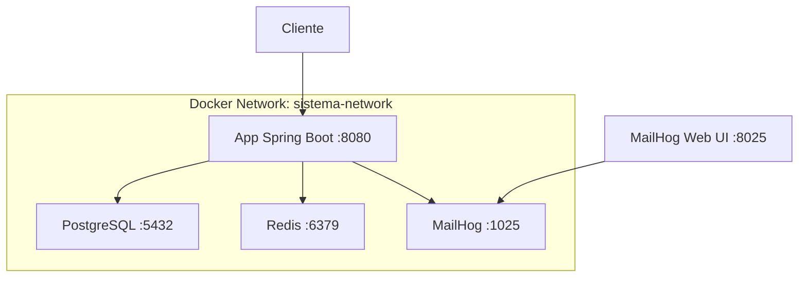

# Documentação Docker Compose

## Visão Geral

O Sistema Java utiliza Docker Compose para orquestrar múltiplos serviços em containers, proporcionando um ambiente completo e isolado para desenvolvimento e produção.

## Arquitetura dos Serviços



## Configuração dos Serviços

### 1. Aplicação Spring Boot (app)

```yaml
app:
  build:
    context: ./backend
    dockerfile: Dockerfile
  ports:
    - "8080:8080"
  environment:
    - SPRING_PROFILES_ACTIVE=docker
    - SPRING_DATASOURCE_URL=jdbc:postgresql://postgres:5432/sistema_db
    - SPRING_DATASOURCE_USERNAME=sistema_user
    - SPRING_DATASOURCE_PASSWORD=sistema_pass
    - SPRING_REDIS_HOST=redis
    - SPRING_REDIS_PORT=6379
    - SPRING_MAIL_HOST=mailhog
    - SPRING_MAIL_PORT=1025
  depends_on:
    - postgres
    - redis
  networks:
    - sistema-network
  restart: unless-stopped
```

**Características**:
- **Build Context**: `./backend`
- **Dockerfile**: Multi-stage build com Maven e OpenJDK
- **Porta Exposta**: 8080
- **Dependências**: PostgreSQL e Redis
- **Profile**: docker (configurações específicas para container)

### 2. PostgreSQL Database (postgres)

```yaml
postgres:
  image: postgres:15-alpine
  environment:
    - POSTGRES_DB=sistema_db
    - POSTGRES_USER=sistema_user
    - POSTGRES_PASSWORD=sistema_pass
  ports:
    - "5432:5432"
  volumes:
    - postgres_data:/var/lib/postgresql/data
  networks:
    - sistema-network
  restart: unless-stopped
  healthcheck:
    test: ["CMD-SHELL", "pg_isready -U sistema_user -d sistema_db"]
    interval: 30s
    timeout: 10s
    retries: 5
```

**Características**:
- **Imagem**: PostgreSQL 15 Alpine (menor footprint)
- **Banco**: sistema_db
- **Usuário**: sistema_user
- **Volume Persistente**: postgres_data
- **Health Check**: Verificação de conectividade

### 3. Redis Cache (redis)

```yaml
redis:
  image: redis:7-alpine
  command: redis-server --appendonly yes
  ports:
    - "6379:6379"
  volumes:
    - redis_data:/data
  networks:
    - sistema-network
  restart: unless-stopped
  healthcheck:
    test: ["CMD", "redis-cli", "ping"]
    interval: 30s
    timeout: 10s
    retries: 5
```

**Características**:
- **Imagem**: Redis 7 Alpine
- **Persistência**: AOF (Append Only File) habilitado
- **Volume Persistente**: redis_data
- **Health Check**: Comando PING

### 4. MailHog (mailhog)

```yaml
mailhog:
  image: mailhog/mailhog:latest
  ports:
    - "1025:1025"  # SMTP
    - "8025:8025"  # Web UI
  networks:
    - sistema-network
  restart: unless-stopped
```

**Características**:
- **SMTP**: Porta 1025 para envio de emails
- **Web UI**: Porta 8025 para interface web
- **Uso**: Captura emails enviados pela aplicação

## Rede e Comunicação

### Rede Interna

```yaml
networks:
  sistema-network:
    driver: bridge
```

**Comunicação entre serviços**:
- `app` → `postgres`: jdbc:postgresql://postgres:5432/sistema_db
- `app` → `redis`: redis://redis:6379
- `app` → `mailhog`: smtp://mailhog:1025

### Resolução de Nomes

O Docker Compose cria automaticamente aliases DNS:
- `postgres` → Container PostgreSQL
- `redis` → Container Redis
- `mailhog` → Container MailHog
- `app` → Container Spring Boot

## Volumes e Persistência

### Volumes Definidos

```yaml
volumes:
  postgres_data:
    driver: local
  redis_data:
    driver: local
```

### Localização dos Dados

```bash
# Listar volumes
docker volume ls

# Inspecionar volume
docker volume inspect sistema_java_postgres_data

# Localização típica (Linux)
/var/lib/docker/volumes/sistema_java_postgres_data/_data
```

### Backup e Restore

```bash
# Backup PostgreSQL
docker compose exec postgres pg_dump -U sistema_user sistema_db > backup_$(date +%Y%m%d_%H%M%S).sql

# Restore PostgreSQL
docker compose exec -T postgres psql -U sistema_user sistema_db < backup.sql

# Backup Redis
docker compose exec redis redis-cli BGSAVE
docker cp $(docker compose ps -q redis):/data/dump.rdb ./redis_backup_$(date +%Y%m%d_%H%M%S).rdb
```

## Dockerfile da Aplicação

### Multi-stage Build

```dockerfile
# Stage 1: Build
FROM maven:3.9.6-eclipse-temurin-17 AS build
WORKDIR /app

# Copy pom.xml and download dependencies
COPY pom.xml .
RUN mvn dependency:go-offline -B

# Copy source code and build
COPY src ./src
RUN mvn clean package -DskipTests

# Stage 2: Runtime
FROM eclipse-temurin:17-jre-alpine
WORKDIR /app

# Copy JAR from build stage
COPY --from=build /app/target/*.jar app.jar

# Expose port
EXPOSE 8080

# Run application
ENTRYPOINT ["java", "-jar", "app.jar"]
```

**Vantagens**:
- **Imagem Final Menor**: Apenas JRE, sem Maven/JDK
- **Cache de Dependências**: Layers otimizados
- **Segurança**: Imagem Alpine minimalista

## Comandos de Gerenciamento

### Ciclo de Vida

```bash
# Iniciar todos os serviços
docker compose up -d

# Parar todos os serviços
docker compose down

# Reiniciar serviços
docker compose restart

# Reconstruir e iniciar
docker compose up -d --build

# Parar e remover volumes
docker compose down -v
```

### Monitoramento

```bash
# Status dos serviços
docker compose ps

# Logs de todos os serviços
docker compose logs -f

# Logs de um serviço específico
docker compose logs app -f --tail 50

# Estatísticas de recursos
docker stats

# Inspecionar serviço
docker compose exec app bash
```

### Scaling (se necessário)

```bash
# Escalar aplicação (múltiplas instâncias)
docker compose up -d --scale app=3

# Verificar instâncias
docker compose ps app
```

## Health Checks

### Configuração

Todos os serviços possuem health checks configurados:

```yaml
# PostgreSQL
healthcheck:
  test: ["CMD-SHELL", "pg_isready -U sistema_user -d sistema_db"]
  interval: 30s
  timeout: 10s
  retries: 5

# Redis
healthcheck:
  test: ["CMD", "redis-cli", "ping"]
  interval: 30s
  timeout: 10s
  retries: 5

# Aplicação (se configurado)
healthcheck:
  test: ["CMD", "curl", "-f", "http://localhost:8080/api/health"]
  interval: 30s
  timeout: 10s
  retries: 3
  start_period: 40s
```

### Verificação

```bash
# Ver status de health
docker compose ps

# Logs de health check
docker inspect $(docker compose ps -q postgres) | jq '.[0].State.Health'
```

## Configurações de Ambiente

### Profiles do Spring Boot

#### application-docker.properties
```properties
# Database
spring.datasource.url=jdbc:postgresql://postgres:5432/sistema_db
spring.datasource.username=sistema_user
spring.datasource.password=sistema_pass

# Redis
spring.redis.host=redis
spring.redis.port=6379

# Mail
spring.mail.host=mailhog
spring.mail.port=1025

# JPA
spring.jpa.hibernate.ddl-auto=update
spring.jpa.show-sql=false

# Logging
logging.level.com.sistema=INFO
logging.level.org.springframework.web=DEBUG
```

### Variáveis de Ambiente Customizáveis

Crie um arquivo `.env` para personalizar:

```bash
# .env
COMPOSE_PROJECT_NAME=sistema_java
APP_PORT=8080
POSTGRES_PORT=5432
REDIS_PORT=6379
MAILHOG_SMTP_PORT=1025
MAILHOG_WEB_PORT=8025

# Database
POSTGRES_DB=sistema_db
POSTGRES_USER=sistema_user
POSTGRES_PASSWORD=sistema_pass

# Application
SPRING_PROFILE=docker
JAVA_OPTS=-Xmx512m -Xms256m
```

## Troubleshooting Docker

### Problemas Comuns

#### 1. Serviços não iniciam
```bash
# Verificar logs
docker compose logs

# Verificar recursos
docker system df

# Limpar cache
docker system prune
```

#### 2. Problemas de conectividade
```bash
# Testar conectividade entre containers
docker compose exec app ping postgres
docker compose exec app ping redis

# Verificar rede
docker network ls
docker network inspect sistema_java_sistema-network
```

#### 3. Problemas de build
```bash
# Build sem cache
docker compose build --no-cache

# Build com logs detalhados
docker compose build --progress=plain
```

#### 4. Problemas de volume
```bash
# Verificar volumes
docker volume ls

# Inspecionar volume
docker volume inspect sistema_java_postgres_data

# Remover volumes órfãos
docker volume prune
```

### Debugging

```bash
# Entrar no container da aplicação
docker compose exec app bash

# Verificar variáveis de ambiente
docker compose exec app env

# Verificar conectividade do banco
docker compose exec app nc -zv postgres 5432

# Verificar conectividade do Redis
docker compose exec app nc -zv redis 6379

# Testar endpoint interno
docker compose exec app curl localhost:8080/api/health
```

## Otimizações

### Performance

```yaml
# Limitar recursos
services:
  app:
    deploy:
      resources:
        limits:
          memory: 1G
          cpus: '0.5'
        reservations:
          memory: 512M
          cpus: '0.25'
```

### Segurança

```yaml
# Usuário não-root
services:
  app:
    user: "1000:1000"
    
# Rede isolada
networks:
  sistema-network:
    driver: bridge
    internal: true  # Sem acesso à internet
```

### Cache de Build

```bash
# Usar BuildKit para cache avançado
export DOCKER_BUILDKIT=1
export COMPOSE_DOCKER_CLI_BUILD=1

# Build com cache
docker compose build --build-arg BUILDKIT_INLINE_CACHE=1
```

## Monitoramento Avançado

### Métricas com cAdvisor

```yaml
# Adicionar ao docker-compose.yml
cadvisor:
  image: gcr.io/cadvisor/cadvisor:latest
  ports:
    - "8081:8080"
  volumes:
    - /:/rootfs:ro
    - /var/run:/var/run:ro
    - /sys:/sys:ro
    - /var/lib/docker/:/var/lib/docker:ro
```

### Logs Centralizados

```yaml
# Configurar driver de log
services:
  app:
    logging:
      driver: "json-file"
      options:
        max-size: "10m"
        max-file: "3"
```

---

## Próximos Passos

1. Configurar monitoramento com Prometheus/Grafana
2. Implementar CI/CD pipeline
3. Configurar backup automático
4. Adicionar testes de integração
5. Configurar SSL/TLS para produção